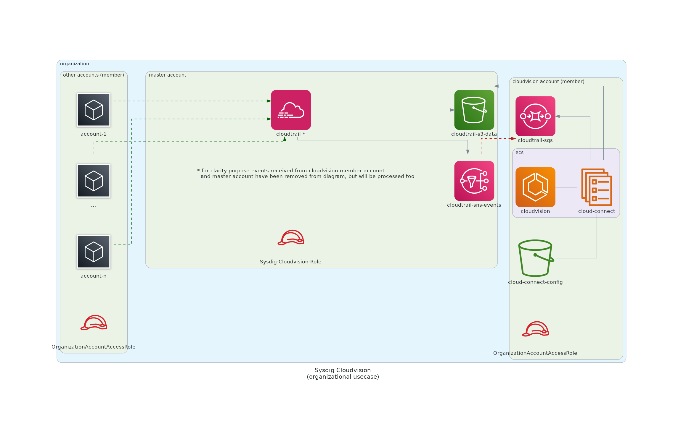

# Cloud Vision deployment in AWS

Terraform module that deploys the **Sysdig CloudVision** stack in **AWS**.

Currently supported cloudvision components:
- [X] cloud-connector
- [ ] cloud-scanner
- [ ] cloud-bench


For other cloud providers check:
- [terraform-azure-cloudvision](https://github.com/sysdiglabs/terraform-azurerm-cloudvision)
- [terraform-google-cloudvision](https://github.com/sysdiglabs/terraform-google-cloudvision)

## Prerequisites

Minimum requirements:

1.  Have an existing AWS account as the organization master account
    - organzational cloudTrail service must be enabled
1.  AWS profile credentials configuration of the `master` account of the organization
    - this account credentials must be [able to manage cloudtrail creation](https://docs.aws.amazon.com/awscloudtrail/latest/userguide/creating-trail-organization.html)
        > You must be logged in with the management account for the organization to create an organization trail. You must also have sufficient permissions for the IAM user or role in the management account to successfully create an organization trail.
    - credentials will be picked from `default` aws profile, but can be changed vía [vars.terraform\_connection\_profile](#input\_terraform\_connection\_profile)
    - cloudvision organizational member account id, as input variable value
        ```
       org_cloudvision_account_id=<ORGANIZATIONAL_CLOUDVISION_ACCOUNT_ID>
        ```
1. Secure requirements, as input variable value
    ```
    sysdig_secure_api_token=<SECURE_API_TOKEN>
    ```

See main module [variables.tf](./variables.tf) file for more optional configuration.

## Usage

```terraform
module "cloudvision_aws" {
  source = "sysdiglabs/cloudvision/aws"

  sysdig_secure_api_token        = "00000000-1111-2222-3333-444444444444"
  org_cloudvision_account_id     = "<ORG_MEMBER_ACCOUNT_FOR_CLOUDVISION>"
  org_cloudvision_account_region = "<REGION_CLOUDVISION_RESOURCES; eg: eu-central-1>"
}
```

see [/examples](./examples) folder for current use-cases.

### use-cases

- organizational cloudtrail (cloud-connect)


<!-- BEGIN_TF_DOCS -->
## Requirements

| Name | Version |
|------|---------|
| <a name="requirement_aws"></a> [aws](#requirement\_aws) | >= 3.50.0 |

## Providers

| Name | Version |
|------|---------|
| <a name="provider_aws"></a> [aws](#provider\_aws) | >= 3.50.0 |

## Modules

| Name | Source | Version |
|------|--------|---------|
| <a name="module_cloudtrail_organizational"></a> [cloudtrail\_organizational](#module\_cloudtrail\_organizational) | ./modules/cloudtrail_organizational |  |
| <a name="module_services"></a> [services](#module\_services) | ./modules/services |  |

## Resources

| Name | Type |
|------|------|
| [aws_iam_role.cloudvision_role](https://registry.terraform.io/providers/hashicorp/aws/latest/docs/resources/iam_role) | resource |
| [aws_iam_role_policy.cloudtrail_s3](https://registry.terraform.io/providers/hashicorp/aws/latest/docs/resources/iam_role_policy) | resource |
| [aws_resourcegroups_group.sysdig-cloudvision](https://registry.terraform.io/providers/hashicorp/aws/latest/docs/resources/resourcegroups_group) | resource |
| [aws_iam_policy_document.cloud_vision_role_trusted](https://registry.terraform.io/providers/hashicorp/aws/latest/docs/data-sources/iam_policy_document) | data source |
| [aws_iam_policy_document.cloudtrail_s3](https://registry.terraform.io/providers/hashicorp/aws/latest/docs/data-sources/iam_policy_document) | data source |

## Inputs

| Name | Description | Type | Default | Required |
|------|-------------|------|---------|:--------:|
| <a name="input_org_cloudvision_account_id"></a> [org\_cloudvision\_account\_id](#input\_org\_cloudvision\_account\_id) | the account\_id **within the organization** to be used as cloudvision account | `string` | n/a | yes |
| <a name="input_sysdig_secure_api_token"></a> [sysdig\_secure\_api\_token](#input\_sysdig\_secure\_api\_token) | Sysdig Secure API token | `string` | n/a | yes |
| <a name="input_aws_connection_profile"></a> [aws\_connection\_profile](#input\_aws\_connection\_profile) | AWS connection profile to be used on ~/.aws/credentials for organization master account | `string` | `"default"` | no |
| <a name="input_cloudtrail_org_is_multi_region_trail"></a> [cloudtrail\_org\_is\_multi\_region\_trail](#input\_cloudtrail\_org\_is\_multi\_region\_trail) | testing/economization purpose. true/false whether cloudtrail will ingest multiregional events | `bool` | `true` | no |
| <a name="input_cloudtrail_org_kms_enable"></a> [cloudtrail\_org\_kms\_enable](#input\_cloudtrail\_org\_kms\_enable) | testing/economization purpose. true/false whether s3 should be encrypted | `bool` | `true` | no |
| <a name="input_region"></a> [region](#input\_region) | default region for provisioning | `string` | `"eu-central-1"` | no |
| <a name="input_sysdig_secure_endpoint"></a> [sysdig\_secure\_endpoint](#input\_sysdig\_secure\_endpoint) | Sysdig Secure API endpoint | `string` | `"https://secure.sysdig.com"` | no |
| <a name="input_tags"></a> [tags](#input\_tags) | sysdig cloudvision tags | `map(string)` | <pre>{<br>  "product": "sysdig-cloudvision"<br>}</pre> | no |

## Outputs

No outputs.
<!-- END_TF_DOCS -->

---
## Troubleshooting

- Q: How to **validate cloudvision cloud-connect (thread-detection) provisioning** is working as expected?<br/>
  A: Check each pipeline resource is working as expected (from high to low lvl)
    - select a rule to break manually, from the 'Sysdig AWS Best Practices' policies. for example, 'Delete Bucket Public Access Block'. can you see the event?
    - are there any errors in the ECS task logs? can also check cloudwatch logs
      for previous example we should see the event
      ```
      {"level":"info","component":"console-notifier","time":"2021-07-26T12:45:25Z","message":"A pulic access block for a bucket has been deleted (requesting  user=OrganizationAccountAccessRole, requesting IP=x.x.x.x, AWS  region=eu-central-1, bucket=sysdig-cloudvision-nnnnnn-config)"}
      ```
    - are events consumed in the sqs queue, or are they pending?
    - are events being sent to sns topic?


- Q: How to iterate **cloud-connect modification testing**
  <br/>A: Build a custom docker image of cloud-connect `docker build . -t <DOCKER_IMAGE> -f ./build/cloud-connector/Dockerfile` and upload it to any registry (like dockerhub).
  Modify the [var.image](./modules/services_cloud_connect/variables.tf) variable to point to your image and deploy


- Q: How can I iterate **ECS testing**
  <br/>A: After applying your modifications (vía terraform for example) restart the service
    ```
    $ aws ecs update-service --force-new-deployment --cluster sysdig-cloudvision-ecscluster --service sysdig-cloudvision-cloudconnector --profile <AWS_PROFILE>
    ```

  For the AWS_PROFILE, set your `~/.aws/config` to impersonate
    ```
    [profile cloudvision]
    region=eu-central-1
    role_arn=arn:aws:iam::<AWS_MASTER_ORGANIZATION_ACCOUNT>:role/OrganizationAccountAccessRole
    source_profile=<AWS_MASTER_ACCOUNT_PROFILE>
    ```


---

## Authors

Module is maintained by [Sysdig](https://sysdig.com).

## License

Apache 2 Licensed. See LICENSE for full details.
