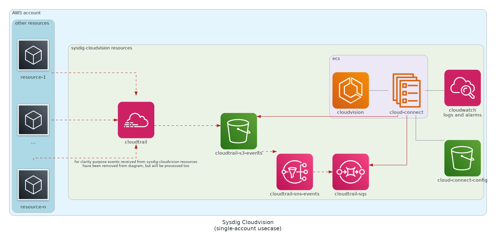

# Cloud Vision deployment in AWS

Terraform module that deploys the **Sysdig CloudVision** stack in **AWS**.

Currently supported cloudvision components:
- [X] cloud-connector (organizational, single-account)
- [ ] cloud-scanner
- [ ] cloud-bench


For other cloud providers check:
- [terraform-azure-cloudvision](https://github.com/sysdiglabs/terraform-azurerm-cloudvision)
- [terraform-google-cloudvision](https://github.com/sysdiglabs/terraform-google-cloudvision)

---

## Example / Use-Cases

### Single-Account

More info in the [`./examples/single-account/README.md`](examples/single-account/README.md)


###  Organizational

More info in the [`./examples/organizational_cloudvision/README.md`](examples/organizational/README.md)


### Self-Baked Usage

If no [examples](./examples) fit your use-case, be free to self-configure your own `cloudvision` module.

```terraform
module "cloudvision_aws" {
  source = "github.com/sysdiglabs/terraform-aws-cloudvision"

  # required to specify cloudvision stack on default AWS provider
  providers = {
    aws.cloudvision = aws
  }
  sysdig_secure_api_token  = "00000000-1111-2222-3333-444444444444"
}

```
See main module [`variables.tf`](./variables.tf) or [inputs summary](./README.md#inputs) file for more optional configuration.

To run this example you need have your [aws master-account profile configured in CLI](https://docs.aws.amazon.com/cli/latest/userguide/cli-configure-profiles.html) and to execute:
```terraform
$ terraform init
$ terraform plan
$ terraform apply
```

Note that:
- This example will create resources that cost money. Run `terraform destroy` when you don't need them anymore
- For more detailed configuration inspect both main module and example input variables
- All created resources will be created within the tags `product:sysdig-cloudvision`, within the resource-group `sysdig-cloudvision`


---

<!-- BEGINNING OF PRE-COMMIT-TERRAFORM DOCS HOOK -->
## Requirements

| Name | Version |
|------|---------|
| <a name="requirement_terraform"></a> [terraform](#requirement\_terraform) | >= 0.15.0 |
| <a name="requirement_aws"></a> [aws](#requirement\_aws) | >= 3.50.0 |

## Providers

No providers.

## Modules

| Name | Source | Version |
|------|--------|---------|
| <a name="module_cloud_connector"></a> [cloud\_connector](#module\_cloud\_connector) | ./modules/services/cloud-connector |  |
| <a name="module_cloudtrail"></a> [cloudtrail](#module\_cloudtrail) | ./modules/infrastructure/cloudtrail |  |
| <a name="module_ecs_fargate_cluster"></a> [ecs\_fargate\_cluster](#module\_ecs\_fargate\_cluster) | ./modules/infrastructure/ecs-fargate-cluster |  |
| <a name="module_resource_group_master"></a> [resource\_group\_master](#module\_resource\_group\_master) | ./modules/infrastructure/resource-group |  |

## Resources

No resources.

## Inputs

| Name | Description | Type | Default | Required |
|------|-------------|------|---------|:--------:|
| <a name="input_sysdig_secure_api_token"></a> [sysdig\_secure\_api\_token](#input\_sysdig\_secure\_api\_token) | Sysdig Secure API token | `string` | n/a | yes |
| <a name="input_cloudtrail_org_is_multi_region_trail"></a> [cloudtrail\_org\_is\_multi\_region\_trail](#input\_cloudtrail\_org\_is\_multi\_region\_trail) | testing/economization purpose. true/false whether cloudtrail will ingest multiregional events | `bool` | `true` | no |
| <a name="input_cloudtrail_org_kms_enable"></a> [cloudtrail\_org\_kms\_enable](#input\_cloudtrail\_org\_kms\_enable) | testing/economization purpose. true/false whether s3 should be encrypted | `bool` | `true` | no |
| <a name="input_is_organizational"></a> [is\_organizational](#input\_is\_organizational) | whether cloudvision should be deployed in an organizational setup | `bool` | `false` | no |
| <a name="input_name"></a> [name](#input\_name) | Name for the Cloud Vision deployment | `string` | `"sysdig-cloudvision"` | no |
| <a name="input_organizational_config"></a> [organizational\_config](#input\_organizational\_config) | oragnizational\_config. following attributes must be given<br><ul><li>`cloudvision_member_account_id` to enable reading permission,</li><li>`cloudvision_role_arn` for cloud-connect assumeRole in order to read cloudtrail s3 events</li><li>and the `connector_ecs_task_role_name` which has been granted trusted-relationship over the cloudvision\_role</li></ul> | <pre>object({<br>    cloudvision_member_account_id = string<br>    cloudvision_role_arn          = string<br>    connector_ecs_task_role_name  = string<br>  })</pre> | <pre>{<br>  "cloudvision_member_account_id": null,<br>  "cloudvision_role_arn": null,<br>  "connector_ecs_task_role_name": null<br>}</pre> | no |
| <a name="input_sysdig_secure_endpoint"></a> [sysdig\_secure\_endpoint](#input\_sysdig\_secure\_endpoint) | Sysdig Secure API endpoint | `string` | `"https://secure.sysdig.com"` | no |
| <a name="input_tags"></a> [tags](#input\_tags) | sysdig cloudvision tags | `map(string)` | <pre>{<br>  "product": "sysdig-cloudvision"<br>}</pre> | no |

## Outputs

| Name | Description |
|------|-------------|
| <a name="output_cloudtrail_s3_arn"></a> [cloudtrail\_s3\_arn](#output\_cloudtrail\_s3\_arn) | sydig-cloudvision cloudtrail s3 arn, required for organizational use case, in order to give proper permissions to cloudconnector role to assume |
<!-- END OF PRE-COMMIT-TERRAFORM DOCS HOOK -->

---
## Troubleshooting

- Q: How to **validate cloudvision cloud-connect (thread-detection) provisioning** is working as expected?<br/>
  A: Check each pipeline resource is working as expected (from high to low lvl)
    - select a rule to break manually, from the 'Sysdig AWS Best Practices' policies. for example, 'Delete Bucket Public Access Block'. can you see the event?
    - are there any errors in the ECS task logs? can also check cloudwatch logs
      for previous example we should see the event
      ```
      {"level":"info","component":"console-notifier","time":"2021-07-26T12:45:25Z","message":"A pulic access block for a bucket has been deleted (requesting  user=OrganizationAccountAccessRole, requesting IP=x.x.x.x, AWS  region=eu-central-1, bucket=sysdig-cloudvision-nnnnnn-config)"}
      ```
    - are events consumed in the sqs queue, or are they pending?
    - are events being sent to sns topic?


- Q: How to iterate **cloud-connect modification testing**
  <br/>A: Build a custom docker image of cloud-connect `docker build . -t <DOCKER_IMAGE> -f ./build/cloud-connector/Dockerfile` and upload it to any registry (like dockerhub).
  Modify the [var.image](modules/services/cloud-connector/variables.tf) variable to point to your image and deploy


- Q: How can I iterate **ECS testing**
  <br/>A: After applying your modifications (vía terraform for example) restart the service
    ```
    $ aws ecs update-service --force-new-deployment --cluster sysdig-cloudvision-ecscluster --service sysdig-cloudvision-cloudconnector --profile <AWS_PROFILE>
    ```

  For the AWS_PROFILE, set your `~/.aws/config` to impersonate
    ```
    [profile cloudvision]
    region=eu-central-1
    role_arn=arn:aws:iam::<AWS_MASTER_ORGANIZATION_ACCOUNT>:role/OrganizationAccountAccessRole
    source_profile=<AWS_MASTER_ACCOUNT_PROFILE>
    ```


---

## Authors

Module is maintained by [Sysdig](https://sysdig.com).

## License

Apache 2 Licensed. See LICENSE for full details.
