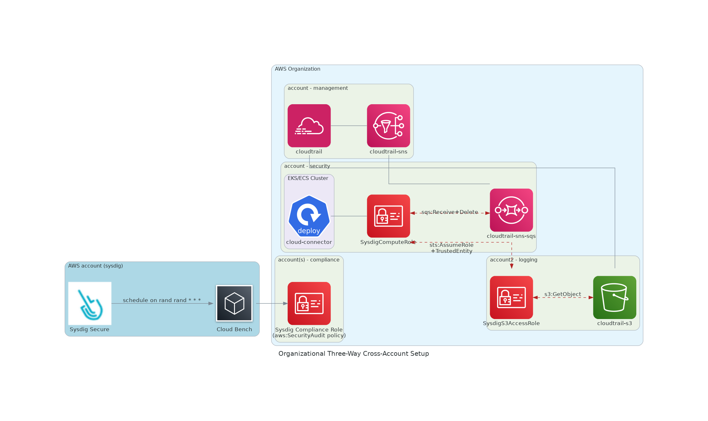

# Organizational Setup with CloudTrail, SNS, and S3

This use case describes setting up Secure for Cloud for a multi-AWS accounts environment with the following:

- AWS Organizational Management account with CloudTrail with Amazon Simple Notification Service (SNS)
- AWS member account with Amazon S3 cloud object storage; bucket is not in the management account of the organization, but on a different logging

This setup will provide the following [Sysdig Secure for Cloud](https://docs.sysdig.com/en/docs/installation/sysdig-secure-for-cloud/) features:

- [Threat Detection](https://docs.sysdig.com/en/docs/sysdig-secure/policies/threat-detect-policies/)

## Prerequisites

- The following event ingestion resources created in the same AWS regions:

  - AWS Organizational Management account

    - Cloudtrail with SNS activated

      For more information, see [Configuring Amazon SNS notifications for CloudTrail](https://docs.aws.amazon.com/awscloudtrail/latest/userguide/configure-sns-notifications-for-cloudtrail.html).

      See the **account-management** module in the diagram given below.

  - AWS member account for logging

    - Cloudtrail-enabled S3 bucket

      For more information, see [CloudTrail event logging for S3 buckets](https://docs.aws.amazon.com/AmazonS3/latest/userguide/enable-cloudtrail-logging-for-s3.html).

      See the **account-logging** module in the diagram given below.

  See the **account-management** and **account-logging** modules (`cloudtrail-sns` and `cloudtrail-s3` bucket) in the diagram given below.

- AWS member account for Sysdig (`SYSDIG_ACCOUNT_ID`)

  - EKS or ECS cluster to deploy Sysdig Secure for Cloud (Cloud Connector)

    See **account-management** and **account-security** modules in the diagram given below.

## Overview

In this setup, you will do the following:



- AWS user account for logging:  In this account, you will create the Sysdig Access S3 Role,`SysdigS3AccessRole`, to retrieve data from the Cloudtail-enabled S3 bucket.

- AWS user account for Sysdig: In this account, you will create the following:

  - Sysdig Compute Role: `ARN_SYSDIG_COMPUTE_ROLE` as given in [Create Compute Role](#create-sysdig-compute-role).

    See the **account-security** modules in the diagram given below.

  - A topic for `cloudtrail-sns-sqs` setting from the organizational Cloudtrail into Cloud Connector compute module.

## Create Sysdig Compute Role

When running the workload on EKS or ECS, use the SysdigComputeRole, `ARN_SYSDIG_COMPUTE_ROLE`.

You configure this role to authenticate and provide permissions for fetching data from the S3 bucket to:

- [Kubernetes Service account](https://docs.aws.amazon.com/eks/latest/userguide/iam-roles-for-service-accounts.html) in EKS clusters. See the `serviceAccount.*` properties of the cloud-connector chart

- [TaskRole](https://docs.aws.amazon.com/AmazonECS/latest/userguide/task-iam-roles.html) in ECS

You can do it as follows:

1. Create `SysdigComputeRole` in your cluster.

2. Do the following:

   **EKS** cluster: Use the IAM authentication role mapping setup.

   ```json
   {
       "Version": "2012-10-17",
       "Statement": [
           {
               "Effect": "Allow",
               "Principal": {
                   "Service": "eks.amazonaws.com"
               },
               "Action": "sts:AssumeRole"
           }
       ]
   }
   ```

   **ECS**: Allow Trust relationship for the ECS Task usage.

   ```json
   {
       "Version": "2012-10-17",
       "Statement": [
           {
               "Sid": "",
               "Effect": "Allow",
               "Principal": {
                   "Service": "ecs-tasks.amazonaws.com"
               },
               "Action": "sts:AssumeRole"
           }
       ]
   }
   ```

   For more information, see [Creating IAM roles](https://docs.aws.amazon.com/IAM/latest/UserGuide/id_roles_create.html).

4. Save the SysdigComputeRole, `ARN_SYSDIG_COMPUTE_ROLE`.

## Configure the Cloud Connector

The Sysdig Cloud Connector is a component in Sysdig Secure for Cloud that checks for cloud security issues based on rules defined on Sysdig Secure. This enables compliance and auditing for your cloud-based accounts.

CloudTrail periodically writes log files to the S3 bucket you have configured. When each file is written, it also sends an SNS notification. SQS is subscribing to the notification will hold them until they are processed by Cloud Connector.

The Cloud Connector uses the Cloudtrail ingestion to consume organizational events.

To enable it, you configure the following:

- SQS to ingest the events

- Configure S3 bucket to allow cross-account read

### Prepare SQS

1. Verify that SNS notification is activated for your organizational Cloudtrail.

   See the **account-management** module in the diagram above.

   For more information, see [Configuring Amazon SNS notifications for CloudTrail](https://docs.aws.amazon.com/awscloudtrail/latest/userguide/configure-sns-notifications-for-cloudtrail.html).

2. On the account, where Sysdig is deployed, create an SQS topic to ingest Cloudtrail events.

   1. While configuration, accept the default parameters.

   2. Edit the **Access policy** and enable `SNS:Subscribe` permissions on the queue:

      ```json
      {
        "Sid": "AllowCrossAccountSNSSubscription",
        "Effect": "Allow",
        "Principal": {
          "AWS": "<ARN_SUBSCRIPTION_ACTION_USER>"
        },
        "Action": "sns:Subscribe",
        "Resource": "<ARN_CLOUDTRAIL_SNS>"
      }
      ```

       This permission lifts the cross-account limitations.

   3. Save `SYSDIG_CLOUDTRAIL_SNS_SQS_URL` and `ARN_CLOUDTRAIL_SNS_SQS` for later use.

### Configure Cross-Account S3 Access

In the organizational account, configure the access credentials for cross-aacount access for the Cloudtrail-enabled S3 bucket.

1. Create a new role named  `SysdigS3AccessRole` to retrieve S3 data. Save it as `ARN_ROLE_SYSDIG_S3_ACCESS`.

   ```yaml
   {
       "Sid": "AllowSysdigReadS3",
       "Effect": "Allow",
       "Action": [
         "s3:GetObject"
       ],
       "Resource": "<ARN_CLOUDTRAIL_S3>/*"
   }
   ```

2. Provide the same retrieve permissions on the S3 bucket. To do so, add following statement to the Bucket policy:

   ```yaml
   {
       "Sid": "AllowSysdigReadS3",
       "Effect": "Allow",
       "Principal": {
         "AWS": "<ARN_ROLE_SYSDIG_S3_ACCESS>"
       },
       "Action": "s3:GetObject",
       "Resource": "<ARN_CLOUDTRAIL_S3>/*"
    }
   ```

3. Allow cross-account `assumeRole` Trust Relationship as follows.  This will allow `SysdigComputeRole` to use the `SysdigS3AccessRole`:

   ```yaml
   {
   "Sid": "AllowSysdigAssumeRole",
   "Effect": "Allow",
   "Principal": {
   "AWS": "<ARN_SYSDIG_COMPUTE_ROLE>"
   },
   "Action": "sts:AssumeRole"
   }
   ```

## Deploy Sysdig Secure for Cloud

### Provide Permissions to the Sysdig Compute Role

In the Sysdig AWS member account, edit the `SysdigComputeRole` that you have created and add permission to:

- Perform necessary actions by Secure for Cloud compute.
- Work with SQS and access S3 resources.

```json
{
    "Version": "2012-10-17",
    "Statement": [
     {
            "Effect": "Allow",
            "Action": [
                "SQS:ReceiveMessage",
                "SQS:DeleteMessage"
            ],
            "Resource": "<ARN_CLOUDTRAIL_SNS_SQS>"
        },
        {
            "Effect": "Allow",
            "Action": [
                "sts:AssumeRole"
            ],
            "Resource": "<ARN_SYSDIG_S3_ACCESS_ROLE>"
        }
    ]
}
```

### Deploy Cloud Connector

#### EKS

1. Retrieve your `<SYSDIG_SECURE_ENDPOINT>` and `<SYSDIG_SECURE_API_TOKEN>`.

   See [Retrieve API Token](https://docs.sysdig.com/en/docs/administration/administration-settings/user-profile-and-password/retrieve-the-sysdig-api-token) for more information.

2. Use the [Sysdig cloud-connector helm chart](https://charts.sysdig.com/charts/cloud-connector/) to Locate your `<SYSDIG_SECURE_ENDPOINT>` and `<SYSDIG_SECURE_API_TOKEN>`.

   Use the following `values.yaml` template:

   ```yaml
   sysdig:
     url: "https://secure.sysdig.com"
     secureAPIToken: "SYSDIG_API_TOKEN"
   telemetryDeploymentMethod: "helm_aws_k8s_org"  # not required but would help us
   aws:
       region: <SQS-AWS-REGION>
   ingestors:
       - cloudtrail-sns-sqs:
           queueURL:"<URL_CLOUDTRAIL_SNS_SQS>"             # step 3
           assumeRole:"<ARN_ROLE_SYSDIG_S3_ACCESS>"        # step 4
   ```

   For additional information on authentication options, see the  `serviceAccount.*` and `aws.*` values in the [cloud-connector helm chart](https://charts.sysdig.com/charts/cloud-connector/).

3. Run the following:

   ```
   helm upgrade --install --create-namespace -n sysdig-cloud-connector sysdig-cloud-connector sysdig/cloud-connector -f values.yaml
   ```

4. To verify the installation, run:

   ```
   kubectl logs -f -n sysdig-cloud-connector deployment/sysdig-cloud-connector
   ```

   ​  If you want to uninstall,  run:

   ```
   helm uninstall -n sysdig-cloud-connector sysdig-cloud-connector
   ```

#### ECS

If you are using an ECS cluster to deploy Cloud Connector, create a new Fargate Task with the following.

- **TaskRole**: Use the `SysdigComputeRole` you have created earlier.

- **Task memory (GB)**:  0.5

- **Task CPU (vCPU)** :  0.25

- **Container definition**: Specify the following:

  - Image: `quay.io/sysdig/cloud-connector:latest`

  - Port Mappings:  bind port 5000 TCP Protocol

  - Environment variables:

    - `SECURE_URL`: The URL associated with your Sysdig account. See [SaaS Regions and IP Ranges](https://docs.sysdig.com/en/docs/administration/saas-regions-and-ip-ranges/) for more information.
    - `SECURE_API_TOKEN`: See [Retrieve API Token](https://docs.sysdig.com/en/docs/administration/administration-settings/user-profile-and-password/retrieve-the-sysdig-api-token) for more information.
    - `CONFIG`:  A base64 encoded configuration of the `cloud-connector` service:

    ```yaml
    logging: info
    rules: []
    ingestors:
        - cloudtrail-sns-sqs:
            queueURL: <URL_CLOUDTRAIL_SNS_SQS>
            assumeRole: <ARN_ROLE_SYSDIG_S3_ACCESS>
    ```

## Verify Configuration

1. Log in to Sysdig Secure.
2. Navigate to **Integrations** > **Cloud Accounts**.
3. Navigate to **Insights** > **Cloud Activity**.

## Learn More

- [Secure for Cloud Use Cases for AWS Environments](./README.md)

- [Verify Services Are Working](https://docs.sysdig.com/en/docs/installation/sysdig-secure-for-cloud/deploy-sysdig-secure-for-cloud-on-gcp/#confirm-the-services-are-working)

- [Forcing Events](https://github.com/sysdiglabs/terraform-google-secure-for-cloud#forcing-events)

<!--

all in same region
management account - cloudtrail (no kms for quick test)
log archive account - s3, sns, sqs

0.1 Provision an S3 bucket in the selected region and allow cloudtrail access
{
    "Version": "2012-10-17",
    "Statement": [
        {
            "Sid": "Statement1",
            "Effect": "Allow",
            "Principal": {
                "Service": "cloudtrail.amazonaws.com"
            },
            "Action": "s3:PutObject",
            "Resource": "S3_ARN/*"
        },
        {
            "Sid": "Statement2",
            "Effect": "Allow",
            "Principal": {
                "Service": "cloudtrail.amazonaws.com"
            },
            "Action": "s3:GetBucketAcl",
            "Resource": "S3_ARN"
        }
    ]
}

0.2. Provision the s3 bucket sns event notification. Need to add permissions to SNS
{
      "Sid": "AllowS3ToPublishSNS",
      "Effect": "Allow",
      "Principal": {
        "Service": "s3.amazonaws.com"
      },
      "Action": [
        "SNS:Publish"
      ],
      "Resource": "ARN_SNS"
    }
-->

<!--

1. Kubernetes **Credentials** creation
   - This step is not really required if Kubernetes role binding is properly configured for the deployment, with an
     IAM role with required permissions listed in following points.
   - Otherwise, we will create an AWS user `SYSDIG_K8S_USER_ARN`, with `SYSDIG_K8S_ACCESS_KEY_ID` and
     `SYSDIG_K8S_SECRET_ACCESS_KEY`, in order to give Kubernetes compute permissions to be able to handle S3 and SQS operations
   - Secure for Cloud [does not manage IAM key-rotation, but find some suggestions to rotate access-key](https://github.com/sysdiglabs/terraform-aws-secure-for-cloud/tree/master/modules/infrastructure/permissions/iam-user#access-key-rotation)<br/><br/>
     -->

<!--
    - If SQS and EKS cluster are within the same account, you will only need to give **permissions** to either SysdigCompute IAM role or SQS.
<br/>[Otherwise, you will need to provide permissions for both](https://aws.amazon.com/premiumsupport/knowledge-center/sqs-accessdenied-errors/#Amazon_SQS_access_policy_and_IAM_policy).
<br/>Use following snipped if required.
```txt
{
"Sid": "AllowSysdigProcessSQS",
"Effect": "Allow",
"Principal": {
"AWS": "<SYSDIG_COMPUTE_ROLE_ARN>"
},
"Action": [
"SQS:ReceiveMessage",
"SQS:DeleteMessage"
],
"Resource": "<CLOUDTRAIL_SNS_SQS_ARN>"
}
```
-->

<!--

AWS Systems Manager
Application Manager
CustomGroup: iru

AWS::SSM::Parameter
Type: SecureString
Data type: text

In ContainerDefinition, secrets

- SECURE_API_TOKEN, `secretName`

ExecutionRole
{
"Version": "2012-10-17",
"Statement": [
{
"Sid": "",
"Effect": "Allow",
"Action": "ssm:GetParameters",
"Resource": "arn:aws:ssm:eu-west-3:**:parameter/**"
}
]
}
-->
