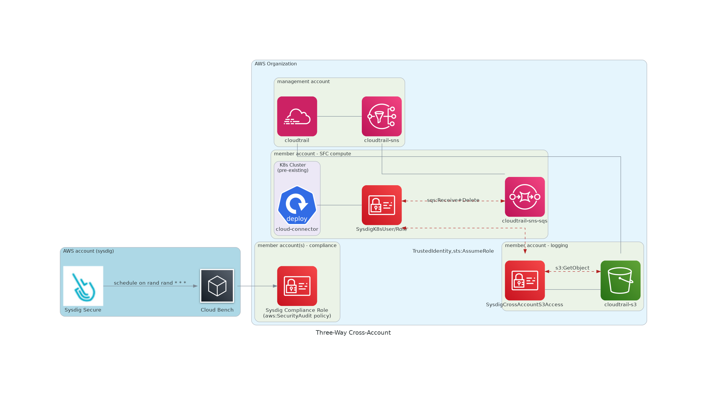

# Organizational - Three way Cross-Account- Kubernetes only (no TF) - Threat Detection and Compliance

## Use-Case explanation

- Organizational setup
    - Dynamic environments with accounts created and destroyed on-demand
    - Pre-Existing organizational-cloudtrail
      - Cloudtrail-SNS activated (in management account)
      - Cloudtrail-S3 is not in the management account, but in a log-archive member account
    - Sysdig features: Threat-detection and Compliance for selected org accounts. No image scanning
- Due to dynamic nature of customer's environment, a heavy programmatically ops tooling are used (not including Terraform) .
- A summary of the required resources/permissions will be done, so they're provisioned for the Secure for Cloud features to work.

## Infrastructure Solution

As a quick summary we'll need
- Organizational **Management** Account
    - Pre-Existing organizational-cloudtrail with SNS activated
- Member Account - **Logs Account**
    - Pre-Existing S3 bucket
    - Create a specific role for CrossAccount S3 access
- Member Account - **Sysdig Compute Account**
    - Pre-Existing K8s cluster for cloud-connector (SFC compute)
    - Crate a Cloudtrail-SNS-SQS wiring, from organizational cloudtrail into cloud-connector compute module
- **Member Account(s)**
    - Sysdig ReadOnly Compliance role setup

Note:
- All event ingestion resource (cloudtrail-sns, and cloudtrail-s3 bucket) live in same `AWS_REGION` AWS region.
  Otherwise, contact us, so we can alleviate this limitation.




We suggest to
- start with Cloud-Connector module required infrastructure wiring and deployment; this will cover threat-detection 
  side
- then move on to Compliance role setup
  <br/><br/>

## Cloud-Connector wiring: Organizational Cloudtrail S3 + SNS - SQS

<!--

all in same region
management account - cloudtrail
log archive account - s3, sns, sqs

0.1 Provision an S3 bucket in the selected region and allow cloudtrail access
{
    "Version": "2012-10-17",
    "Statement": [
        {
            "Sid": "AllowCloudtrailToPutS3",
            "Effect": "Allow",
            "Principal": {
                "Service": "cloudtrail.amazonaws.com"
            },
            "Action": "s3:PutObject",
            "Resource": "arn:aws:s3:::irutest-neo4j/*"
        }
    ]
}

0.2. Provision the s3 bucket sns event notification. Need to add permissions to SNS
{
      "Sid": "AllowS3ToPublishSNS",
      "Effect": "Allow",
      "Principal": {
        "Service": "s3.amazonaws.com"
      },
      "Action": [
        "SNS:Publish"
      ],
      "Resource": "S3_ARN"
    }
-->

<!--
    - If SQS and EKS cluster are within the same account, you will only need to give **permissions** to either SysdigCompute IAM role or SQS.
<br/>[Otherwise, you will need to provide permissions for both](https://aws.amazon.com/premiumsupport/knowledge-center/sqs-accessdenied-errors/#Amazon_SQS_access_policy_and_IAM_policy).
<br/>Use following snipped if required.
```txt
{
"Sid": "AllowSysdigProcessSQS",
"Effect": "Allow",
"Principal": {
"AWS": "<SYSDIG_COMPUTE_ROLE_ARN>"
},
"Action": [
"SQS:ReceiveMessage",
"SQS:DeleteMessage"
],
"Resource": "<CLOUDTRAIL_SNS_SQS_ARN>"
}
```
-->


We will leverage Secure for Cloud - cloudtrail ingestion, in order to consume organizational events. 
For that, we will need to prepare an SQS to ingest the events, and the Cloudtrail-S3 bucket, in order to allow 
cross-account read.

1. Verify that your Organizational Cloudtrail has the **Cloudtrail-SNS notification activated** within same account and 
   region.<br/><br/>

2. In your organization, **choose a member account** as `SYSDIG_ACCOUNT_ID`.<br/>Ideally, this account will gather the EKS cluster where Sysdig compute workload will be deployed, and the SQS to 
ingest Cloudtrail events.<br/><br/>

3. In `SYSDIG_ACCOUNT_ID`, create an **SQS queue** (in the same region as the SNS/EKS).
Default queue parametrization is enough.
   - Subscribe the Cloudtrail-SNS topic to it.
   - Due to cross-account limitations, you may need to enable `SNS:Subscribe` permissions on the queue first
    ```json
    {
      "Sid": "AllowCrossAccountSNSSubscription",
      "Effect": "Allow",
      "Principal": {
        "AWS": "<SPECIFIC_USER_ARN>"
      },
      "Action": "sns:Subscribe",
      "Resource": "<CLOUDTRAIL_SNS_ARN>"
    }
    ```
   - Save `SYSDIG_CLOUDTRAIL_SNS_SQS_URL` and `SYSDIG_CLOUDTRAIL_SNS_SQS_ARN` for later<br/><br/>

4. Configure **Cross-Account S3 access-credentials**
   - In the organizational account where Cloudtrail-S3 bucket is placed, create a new role to handle following permissions and save `SYSDIG_S3_ACCESS_ROLE_ARN`
     ```json
     {
         "Sid": "AllowSysdigReadS3",
         "Effect": "Allow",
         "Action": [
           "s3:GetObject"
         ],
         "Resource": "<CLOUDTRAIL_S3_ARN>/*"
     }
     ```
   - Now we will need to perform same permissions setup on the S3 bucket. Add following Statement to the Bucket policy
      ```json
      {
          "Sid": "AllowSysdigReadS3",
          "Effect": "Allow",
          "Principal": {
            "AWS": "<SYSDIG_S3_ACCESS_ROLE_ARN>"
          },
          "Action": "s3:GetObject",
          "Resource": "<CLOUDTRAIL_S3_ARN>/*"
       }
        ```
   - Last step, is to allow cross-account `assumeRole`, but first we need to create the user/role on next steps. We will
     come to this IAM role afterwards.

<br/><br/>


## Secure for Cloud Compute Deployment

In the `SYSDIG_ACCOUNT_ID` account.

1. Kubernetes **Credentials** creation
   - This step is not really required if Kubernetes role binding is properly configured for the deployment, with an
     IAM role with required permissions listed in following points.
   - Otherwise, we will create an AWS user `SYSDIG_K8S_USER_ARN`, with `SYSDIG_K8S_ACCESS_KEY_ID` and
     `SYSDIG_K8S_SECRET_ACCESS_KEY`, in order to give Kubernetes compute permissions to be able to handle S3 and SQS operations
   - Secure for Cloud [does not manage IAM key-rotation, but find some suggestions to rotate access-key](https://github.com/sysdiglabs/terraform-aws-secure-for-cloud/tree/master/modules/infrastructure/permissions/iam-user#access-key-rotation)<br/><br/>

2. **Permissions** Setup
<br/>Check previous point K8s credentials, IAM user or Role, has the following permissions<br/><br/>

   - Be able to assumeRole on `SYSDIG_S3_ACCESS_ROLE_ARN`. 
     <br/>Firstly, this must be setup on the `SYSDIG_S3_ACCESS_ROLE_ARN`
    ```json
    {
      "Effect": "Allow",
      "Principal": {
        "AWS": "<SYSDIG_K8S_USER/ROLE_ARN>"
      },
      "Action": "sts:AssumeRole"
    }
    ```
   
     - As well as in the current `SYSDIG_K8S_USER_ARN` user
    ```json
    {
        "Sid": "AllowSysdigAssumeRoleCrossS3",
        "Effect": "Allow",
        "Action": [
            "sts:AssumeRole"
        ],
        "Resource": "<SYSDIG_S3_ACCESS_ROLE_ARN>"
    }
    ```

   - For the `SYSDIG_K8S_USER_ARN` user, also give SQS access to process events
    ```json
     {
      "Sid": "AllowSysdigProcessSQS",
      "Effect": "Allow",
      "Action": [
        "SQS:ReceiveMessage",
        "SQS:DeleteMessage"
      ],
      "Resource": "<SYSDIG_CLOUDTRAIL_SNS_SQS_ARN>"
        }
    ```
<br/>

3. Sysdig **Helm** [cloud-connector chart](https://charts.sysdig.com/charts/cloud-connector/) will be used with following parametrization
- Locate your `<SYSDIG_SECURE_ENDPOINT>` and `<SYSDIG_SECURE_API_TOKEN>`.<br/> [Howto fetch ApiToken](https://docs.sysdig.com/en/docs/administration/administration-settings/user-profile-and-password/retrieve-the-sysdig-api-token)
- Create a `values.yaml` file with following manifest
```yaml
rules: []
scanners: []
sysdig:
  url: <SYSDIG_SECURE_ENDPOINT>
  secureAPIToken: <SYSDIG_SECURE_API_TOKEN>

aws:
  region: <AWS_REGION>
  accessKeyId: <SYSDIG_K8S_ACCESS_KEY_ID>
  secretAccessKey: <SYSDIG_K8S_SECRET_ACCESS_KEY>

# not required but would help developing product :)
telemetryDeploymentMethod: "helm_aws_k8s_org"

ingestors:
  - aws-cloudtrail-sns-sqs:
      queueURL: <SYSDIG_CLOUDTRAIL_SNS_SQS_URL>
      assumeRole: <SYSDIG_S3_ACCESS_ROLE_ARN>
```


We will install it
```shell
$ helm upgrade --install --create-namespace -n sysdig-cloud-connector sysdig-cloud-connector sysdig/cloud-connector -f values.yaml
```


Test it
```shell
$ kubectl logs -f -n sysdig-cloud-connector deployment/sysdig-cloud-connector
```

And if desired uninstall it
```shell
$ helm uninstall -n sysdig-cloud-connector sysdig-cloud-connector
```

Check that deployment logs throw no errors and can go to [confirm services are working](#confirm-services-are-working) for threat detection functionality checkup.
<br/>
<br/>


## Compliance

On each member-account where compliance wants to be checked (`AWS_ACCOUNT_ID`), we need to provide a role for Sysdig to be able to impersonate and perform `SecurityAudit` tasks.

In addition, we must make Sysdig aware of this accounts and role.
We will guide you to provide, on the Sysdig Secure SaaS backend, the following resources:
- a cloud-account for each member account of your organization where compliance is wanted to be checked
- a task that will run "aws_foundations_bench-1.3.0" schema on previously defined accounts

### Sysdig Side

1. **Register Organization accounts** on Sysdig
    - For each account you want to provision for the Compliance feature, we need to register it on Sysdig Secure
    - For Sysdig Secure backend API communication [How to use development tools](https://docs.sysdig.com/en/docs/developer-tools/). Also, we have this [AWS provisioning script](https://github.com/sysdiglabs/aws-templates-secure-for-cloud/blob/main/utils/sysdig_cloud_compliance_provisioning.sh) as reference, but we will explain it here too.
    ```shell
    $ curl "https://<SYSDIG_SECURE_ENDPOINT>/api/cloud/v2/accounts?upsert=true" \
    --header "Authorization: Bearer <SYSDIG_SECURE_API_TOKEN>" \
    -X POST \
    -H 'Accept: application/json' \
    -H 'Content-Type: application/json' \
    -d '{
       "accountId": "<AWS_ACCOUNT_ID>",
       "alias": "<AWS_ACCOUNT_ALIAS>",
       "provider": "aws",
       "roleAvailable": true,
       "roleName": "SysdigComplianceRole"
    }'
    ```
<br/>

2. Register **Benchmark Task**
    - Create a single task to scope the organization account ids to be assessed.
    - This script does not cover it, but specific regions can be scoped too. Check `Benchmarks-V2` REST-API for more detail
   ```shell
    $ curl -s "https://<SYSDIG_SECURE_ENDPOINT>/api/benchmarks/v2/tasks" \
    --header "Authorization: Bearer <SYSDIG_SECURE_API_TOKEN>" \
    -X POST \
    -H 'Accept: application/json' \
    -H 'Content-Type: application/json' \
    -d '{
      "name": "Sysdig Secure for Cloud (AWS) - Organization",
      "schedule": "0 3 * * *",
      "schema": "aws_foundations_bench-1.2.0",
      "scope": "aws.accountId in ('<AWS_ACCOUNT_ID_1>',...,'<AWS_ACCOUNT_ID_N>')'",
      "enabled": true
    }'
    ```

<br/>

3. Get **Sysdig Federation Trusted Identity**
    - For later usage, fetch the Trusted Identity `SYSDIG_AWS_TRUSTED_IDENTITY_ARN`
    ```shell
    $ curl -s 'https://<SYSDIG_SECURE_ENDPOINT>/api/cloud/v2/aws/trustedIdentity' \
    --header 'Authorization: Bearer <SYSDIG_SECURE_API_TOKEN>'
    ```
   Response pattern:
    ```shell
    arn:aws:iam::SYSDIG_AWS_ACCOUNT_ID:role/SYSDIG_AWS_ROLE_NAME
    ```
<br/>   
   
4. Get **Sysdig ExternalId**
    - For later usage, fetch `SYSDIG_AWS_EXTERNAL_ID` from one of the previously registered GCP accounts. All accounts will have same id (you only need to run it once).
    ```shell
    $ curl -s "https://<SYSDIG_SECURE_ENDPOINT>/api/cloud/v2/accounts/<AWS_ACCOUNT_ID>?includeExternalId=true" \
    --header "Authorization: Bearer <SYSDIG_SECURE_API_TOKEN>"
    ```
   From the resulting payload get the `externalId` attribute value.

<br/>

### Customer's Side

1. Now create `SysdigComplianceRole` on each member account, using [Sysdig Compliance IAM policy](../../general_templates/ComplianceAgentlessRole.yaml) as guidance
  and using the values gathered in previous step.
```json
{
  "Effect": "Allow",
  "Action": "sts:AssumeRole",
  "Principal": {
    "AWS": [ "<SYSDIG_AWS_TRUSTED_IDENTITY_ARN>" ]
  },
  "Condition": {
    "StringEquals": {"sts:ExternalId": "<SYSDIG_AWS_EXTERNAL_ID>"}
  }
}
```

### End-To-End Validation

Validate if Sysdig <-> Customer infra connection is properly made using [`/cloud/accounts/{accountId}
/validateRole`](https://secure.sysdig.com/swagger.html#tag/Cloud/paths/~1api~1cloud~1v2~1accounts~1{accountId}~1validateRole/get)

```bash
$ https://<SYSDIG_SECURE_ENDPOINT>/api/cloud/v2/accounts/<AWS_ACCOUNT_ID>/validateRole \
--header 'Authorization: Bearer <SYSDIG_SECURE_API_TOKEN>'
```

You should get success or the reason of failure.

<br/>


## Confirm services are working

- [Official Docs Check Guide](https://docs.sysdig.com/en/docs/installation/sysdig-secure-for-cloud/deploy-sysdig-secure-for-cloud-on-gcp/#confirm-the-services-are-working)
- [Forcing events](https://github.com/sysdiglabs/terraform-google-secure-for-cloud#forcing-events)
