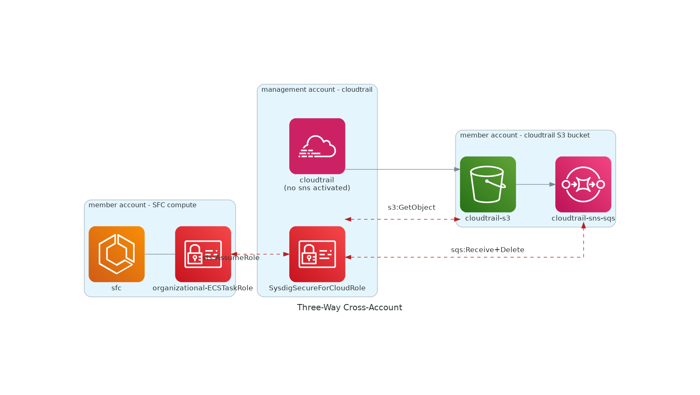

# OrganizationSetup - Three way CrossAccount - Existing Cloudtrail with no SNS - S3-SQS event forward

:warning: WIP.

## Use-Case explanation

**Current User Setup**

- AWS Organization Setup with three-way account setup
  1. Management Account
    - Organizational Cloudtrail, no SNS activation
  2. Log Archive Account
    - Cloudtrail-S3 bucket, SNS and SQS
  3. Member Account
    - Sysdig Secure for cloud deployment
    - Existing VPC network setup.

**Sysdig Secure For Cloud [Features](https://docs.sysdig.com/en/docs/installation/sysdig-secure-for-cloud/)**

- Threat-Detection
- Posture; Compliance + Identity Access Management
  <br/><br/>


## Suggested setup

- We're going to use existing use case [/use-cases/org-existing-cloudtrail-ecs-vpc-subnet.md](./org-existing-cloudtrail-ecs-vpc-subnet.md), with some permission-related changes, due to the three-way cross-account scenario.
- It's important that all required resources (cloudtrail-s3, cloudtrail-s3-sns-sqs, and sysdig workload), is **within same AWS_REGION**. Otherwise, contact us, so we can alleviate this limitation.
- For network setup, please refer to [Sysdig SASS Region and IP Ranges Documentation](https://docs.sysdig.com/en/docs/administration/saas-regions-and-ip-ranges/).

Before proceeding, please read the referenced use-cases and examples and check whether you comply with requirements.
Please contact us if something requires to be adjusted.

### Step by Step Example Guide

<!--

all in same region
management account - cloudtrail
log archive account - s3, sns, sqs

0.1 Provision an S3 bucket in the selected region and allow cloudtrail access
{
    "Version": "2012-10-17",
    "Statement": [
        {
            "Sid": "Statement1",
            "Effect": "Allow",
            "Principal": {
                "Service": "cloudtrail.amazonaws.com"
            },
            "Action": "s3:PutObject",
            "Resource": "S3_ARN/*"
        }
    ]
}

0.2. Provision the s3 bucket sns event forward. Need to add permissions to SNS
{
      "Sid": "AllowS3ToPublishSNS",
      "Effect": "Allow",
      "Principal": {
        "Service": "s3.amazonaws.com"
      },
      "Action": [
        "SNS:Publish"
      ],
      "Resource": "S3_ARN"
    }
-->


#### 1. Configure `AWS_PROFILE` with an organizational Administration credentials

#### 2. Choose an Organizational **Member account for Sysdig Workload** to be deployed.
    - This accountID will be provided in the `SYSDIG_SECURE_FOR_CLOUD_MEMBER_ACCOUNT_ID` parameter

#### 3. Permissions - S3AccessRole
  - Create a `SysdigSecureForCloud-S3AccessRole` in the same account where the S3 bucket exists.
  - We need to input in the principal a role that exists, but becaus we've not launched the terraform yet, we don't have this value.
    <br/>Will add a generic value, and modify afterwards.
    ```text
    {
     "Sid": "AllowSysdigToRead",
     "Effect": "Allow",
     "Principal": {
         "Service": "ecs-tasks.amazonaws.com"
     },
     "Action": "s3:GetObject",
     "Resource": [
         "<CLOUDTRAIL_S3_ARN>",
         "<CLOUDTRAIL_S3_ARN>/*"
     ]
    }
    ```
  - Fetch the created role arn as CLOUDTRAIL_S3_ROLE_ARN

#### 4. Launch Terraform

   - Use provided [Terraform Snippet](#terraform-manifest-snippet)
   - We'll use the `organizational` example
   - General
       - `AWS_REGION` Same region is to be used for both organizational managed account and Sysdig workload member account resources.<br/>
           - Region MUST match both S3 bucket, SNS and SQS
       - `SYSDIG_SECURE_FOR_CLOUD_MEMBER_ACCOUNT_ID` where Sysdig Workload is to be deployed under the pre-existing ECS<br/><br/>

   - Existing Organizational Cloudtrail Setup vía Cloudtrail-S3 vía SNS-SQS event-forwarder.
     <br/>This use-cases is specific for S3 buckets that are isolated in an account that's not the default management account, neither sysdig compute workload depoyment account.
     <br/>Due to S3 access limitations, cross-account access requires a role in the same S3 account, to be assumed by the caller.

      ```terraform
       existing_cloudtrail_config={
          cloudtrail_s3_sns_sqs_arn="<CLOUDTRAIL_S3_SNS_SQS_ARN>"    # for permission setup on ECSTaskRole to be able to access SQS
          cloudtrail_s3_sns_sqs_url="<CLOUDTRAIL_S3_SNS_SQS_URL>"    # for sysdig cloud-connector compute to fetch events
          cloudtrail_s3_role_arn="<CLOUDTRAIL_S3_ROLE_ARN>"          # for ECSTask assumeRole and access S3
      }
     ```

   - Existing ECS Cluster Workload  Setup
       - `ECS_CLUSTER_NAME` ex.: "sfc"

   - Existing Networking Setup
       - `ECS_VPC_ID` ex.: "vpc-0e91bfef6693f296b"
       - `ECS_VPC_SUBNET_PRIVATE_ID_X` Two subnets for the VPC. ex.: "subnet-0c7d803ecdc88437b"

   - With this parameters, you should have a Terraform manifest ready to apply.
   <br/>This should run without errors, but still we've got some more permissions to adjust.

#### 5. Permissions

   We need provided pre-existing cloudtrail S3 and SQS to allow Sysdig Secure to access both resources. That will be done through the `sfc-organizational-ECSTaskRole"` (default name value) role to provide following permissions.
   

##### 5.1 Fetch `SYSDIG_ECS_TASK_ROLE_ARN` ARN

Get this ARN at hand, because it's what you'll use to configure your pre-existing CLOUDTRAIL_S3 and CLOUDTRAIL_S3_SNS_SQS permissions to allow SysdigWorkload to operate with it.

```terraform
$ terraform state list | grep aws_iam_role.connector_ecs_task
<RESULTING_RESOURCE>

$ terraform state show <RESULTING_RESOURCE> | grep "arn"
arn = "arn:aws:iam::****:role/sfc-organizational-ECSTaskRole"
```

##### 5.2 Cloudtrail-S3

- From the previously created `CLOUDTRAIL_S3_ROLE_ARN`, we will change the following in the trusted-identity setup.
    ```
    "Principal": {
    <    "Service": "ecs-tasks.amazonaws.com"
    >    "AWS": "<SYSDIG_ECS_TASK_ROLE_ARN>"
    }
    ```

##### 5.3 Cloudtrail-S3-SNS-SQS

We'll need to add following permissions to the SQS queue
   ```text
    {
      "Sid": "AllowSQSSubscribe",
      "Effect": "Allow",
      "Principal": {
        "AWS": "<SYSDIG_ECS_TASK_ROLE_ARN>"
      },
      "Action": [
        "sqs:ReceiveMessage",
        "sqs:DeleteMessage"
      ],
      "Resource": "<CLOUDTRAIL_S3_SNS_SQS_ARN>"
   }
```

### Terraform Manifest Snippet

```terraform
terraform {
  required_providers {
    sysdig = {
      source  = "sysdiglabs/sysdig"
      configuration_aliases = [aws.member]
    }
  }
}

provider "sysdig" {
  sysdig_secure_url         = "<SYSDIG_SECURE_URL>"
  sysdig_secure_api_token   = "<SYSDIG_SECURE_API_TOKEN>"
}

provider "aws" {
  region = "<AWS_REGION>"       # must match s3 AND sns region
}

# you can setup this provider as desired, just giving an example
# this assumeRole / permission setup is referenced in point #3
provider "aws" {
  alias  = "member"
  region = "<AWS_REGION>"       # must match s3 AND sns region
  assume_role {
    # 'OrganizationAccountAccessRole' is the default role created by AWS for management-account users to be able to admin member accounts.
    # if this is changed, please change to the `examples/organizational` input var `organizational_member_default_admin_role` too
    # <br/>https://docs.aws.amazon.com/organizations/latest/userguide/orgs_manage_accounts_access.html
    role_arn = "arn:aws:iam::<SYSDIG_SECURE_FOR_CLOUD_MEMBER_ACCOUNT_ID>:role/OrganizationAccountAccessRole"
  }
}

module "sysdig-sfc" {
  providers = {
    aws.member = aws.member
  }

  source = "sysdiglabs/secure-for-cloud/aws//examples/organizational"
  name   = "sysdig-sfc"

  sysdig_secure_for_cloud_member_account_id="<SYSDIG_SECURE_FOR_CLOUD_MEMBER_ACCOUNT_ID>"

  existing_cloudtrail_config={
    cloudtrail_s3_sns_sqs_arn="<CLOUDTRAIL_S3_SNS_SQS_ARN>"
    cloudtrail_s3_sns_sqs_url="<CLOUDTRAIL_S3_SNS_SQS_URL>"
    cloudtrail_s3_role_arn="<CLOUDTRAIL_S3_ROLE_ARN>"
  }

  ecs_cluster_name              = "<ECS_CLUSTER_NAME>"
  ecs_vpc_id                    = "<ECS_VPC_ID>"
  ecs_vpc_subnets_private_ids   = ["<ECS_VPC_SUBNET_PRIVATE_ID_1>","<ECS_VPC_SUBNET_PRIVATE_ID_2>"]}
```
